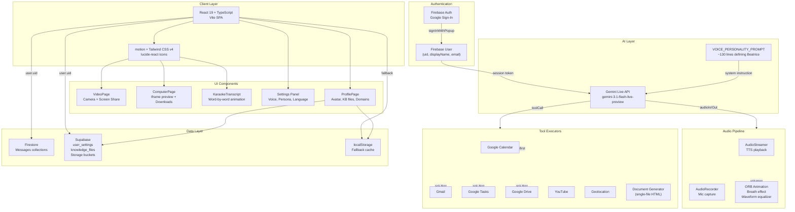

# CLAUDE.md

This file provides guidance to Claude Code (claude.ai/code) when working with code in this repository.

## Project Overview

**Eburon AI Beatrice** — A real-time voice AI assistant built as a single-page application. The app uses the Gemini Live API for voice interaction, Firebase Auth for authentication, and Supabase for structured data persistence.



## Commands

```bash
npm run dev          # Dev server, port 3000, binds 0.0.0.0
npm run dev:api      # Start Express backend (WhatsApp, sandbox)
npm run dev:full     # Run both backend and frontend
npm run build        # Production build via Vite
npm run preview      # Preview production build locally
npm run lint         # Typecheck only (tsc --noEmit)
npm run clean        # Remove dist directory
```

There is no test framework, no CI, and no pre-commit hooks.

## Environment

- `.env.local` holds `GEMINI_API_KEY`, `SUPABASE_URL`, `SUPABASE_PUBLISHABLE_KEY`, and other runtime values. It is gitignored; a template exists at `.env.example`.
- The GEMINI_API_KEY is injected as `process.env.GEMINI_API_KEY` (not `VITE_`-prefixed) via `vite.config.ts` `define`. Do not rename this.
- `DISABLE_HMR=true` disables HMR (used in AI Studio to prevent flickering during agent edits). Keep this check in `vite.config.ts`.
- `APP_URL` is injected by AI Studio at runtime for Cloud Run deployments. Do not hardcode a base URL.

## Architecture

### Entry Point and Monolithic Component

**Entry point:** `index.html` → `src/main.tsx` → `src/App.tsx`

**`src/App.tsx`** (~2800 lines) is the monolithic main component. It contains ALL logic: auth flow, Firestore reads/writes, Gemini Live session management, audio pipeline, tool call handling, settings panel, camera feed, and transcript display. Edit with extreme care — there are no extracted hooks or services.

### Key Source Files

| File | Purpose |
|---|---|
| `src/App.tsx` | Entire application component (auth, Gemini session, audio, tools, UI coordination) |
| `src/firebase.ts` | Firebase init + `handleFirestoreError()` helper for structured error logging |
| `src/lib/audio.ts` | `AudioStreamer` (TTS playback) and `AudioRecorder` (mic capture) |
| `src/lib/supabase.ts` | Supabase client + `handleDbError()` helper |
| `src/lib/supabaseStorage.ts` | Avatar, knowledge files, domain CRUD operations |
| `src/components/KaraokeTranscript.tsx` | Animated word-by-word transcript display |
| `src/components/ProfilePage.tsx` | Avatar upload, knowledge base files, URL domain management |
| `src/components/VideoPage.tsx` | Camera feed + screen share functionality |
| `src/components/ComputerPage.tsx` | Document preview (iframe) + download |
| `src/components/AdminPortal.tsx` | WhatsApp configuration and admin features |
| `src/components/ChatPage.tsx` | Chat interface coordination |
| `src/lib/documentClient.ts` | Document generation orchestration |
| `src/lib/sandboxClient.ts` | Sandbox environment communication |
| `src/lib/whatsappClient.ts` | WhatsApp integration client |
| `src/index.css` | Single `@import "tailwindcss";` line (Tailwind v4) |
| `vite.config.ts` | Path alias `@` → `.`, Tailwind v4 plugin, env injection |

### Authentication Flow

1. User clicks Sign In → `signInWithPopup(Google)` via Firebase Auth
2. Firebase returns `UserCredential` (uid, email, displayName)
3. App creates User document in Firestore (`/users/{userId}`)
4. App upserts `user_settings` in Supabase
5. Gemini Live session starts with auth context
6. Beatrice interface is shown to user

### Gemini Live Session Lifecycle

- **Idle** → **Connecting**: User taps mic
- **Connecting** → **Connected**: Session established
- **Connected** → **Streaming**: User speaks / AI responds
- **Connected** → **ToolCalling**: AI requests tool execution
- **ToolCalling** → **Streaming**: Tool result returned
- **Streaming** → **Connected**: Turn complete
- **Connected** → **Idle**: User stops / timeout
- **Idle** → **PendingPermission**: First tool use
- **PendingPermission** → **Idle**: User denies
- **PendingPermission** → **Connected**: User approves

### Tool Call Flow (Google Services)

When Beatrice requests a tool call (e.g., `list_calendar_events`):

1. App checks the `_confirmed` flag
2. **First call (no `_confirmed`)**: App asks user "Just checking — do you want me to ...?"
3. Beatrice asks permission in conversation
4. User responds "Yes, go ahead"
5. Beatrice sends toolCall with `_confirmed: true`
6. App executes API call and formats result as HTML page
7. **Already confirmed**: Direct execution without asking

### Knowledge Base Persistence

- **Local Cache (always)**: `localStorage` keys `beatrice_knowledge_domains`
- **Supabase (primary)**: `user_settings` table (`knowledge_domains` column), `knowledge_files` table, Storage buckets (`knowledge-base`)
- **Fallback**: If Supabase fails, localStorage is used
- **Load on mount**: ProfilePage loads from Supabase first, then localStorage fallback

### Settings Persistence

- Frontend state: `settings` (personaName, selectedVoice, contextSize, userTitle, authLanguage)
- **Save**: UPSERT to Supabase `user_settings` table + localStorage for `beatrice_userTitle` and `beatrice_language`
- **Load on mount**: Supabase `.single()` query first, then localStorage fallback

## Firebase + Firestore

- Config lives in `firebase-applet-config.json` (not `.env`).
- Firestore blueprint: `firebase-blueprint.json` defines `User` and `Message` schemas.
- **Messages are immutable** — `allow update, delete: if false` in `firestore.rules`. Never attempt to edit or delete messages.
- Every Firestore operation must use `handleFirestoreError()` from `src/firebase.ts` for structured error logging (includes auth context).
- Security invariants in `security_spec.md` must be preserved: user data isolation, timestamp validation (`== request.time`), role constrained to `user`/`model`, field validation by whitelist, length limits (`personaName` ≤ 50, `customPrompt` ≤ 2000, `message.text` ≤ 5000, document ID ≤ 128 chars matching `^[a-zA-Z0-9_\-]+$`).

## Gemini Live API

- SDK: `@google/genai` (`^1.29.0`), model: `gemini-3.1-flash-live-preview`.
- Audio modalities are used for real-time voice; tool calls (`toolCall` in `onmessage` callback) drive Google Services integration (Gmail, Calendar, Tasks, YouTube, Drive).
- The voice personality prompt (`VOICE_PERSONALITY_PROMPT`) is a ~130-line constant in `App.tsx`. Do not alter it casually — it defines the entire agent persona.

## UI / Styling

- Tailwind CSS v4 via `@tailwindcss/vite` plugin — uses `@import "tailwindcss"` syntax, no `tailwind.config.*`.
- Animation library: `motion` (formerly framer-motion), imported as `motion/react`.
- Icons: `lucide-react`.
- Markdown rendering: `react-markdown` for chat messages.
- Dark theme: `#050505` background, amber/warm peach (`#d0a78b`) accent.

## Reference UI

`public/reference-ui.html` contains the canonical landing page design with the orb animation, blob drift keyframes, peach glow, transcription area, and bottom nav. Use this as the design source of truth for UI changes.

## WhatsApp Backend

WhatsApp personal-account sessions are handled server-side with Baileys (`@whiskeysockets/baileys`). Each app user gets an isolated auth directory under `WA_AUTH_ROOT`, so multiple users can pair and reconnect independently without sharing a browser or session.

Required backend env:

```bash
SANDBOX_ROOT=./.sandbox
WA_AUTH_ROOT=./.baileys_auth
VITE_SANDBOX_URL=http://localhost:4200
```

Admin portal: Open `/adminportal` after signing in. The portal stores each user's WhatsApp configuration server-side under `WA_AUTH_ROOT/<firebase-user-id>/admin-config.json` and never returns secret values to the browser.

Supported WhatsApp modes:

- **Linked Device**: scan a WhatsApp Linked Devices QR code. This supports sending messages, recent chat history, contacts, groups, and group sends through the Baileys session.
- **Cloud API**: enter a WhatsApp Business Cloud API access token and phone number ID. This supports direct text sends through the official Graph API. Incoming Cloud API webhooks can be pointed at `/api/whatsapp/webhook/<firebase-user-id>`.

Pairing flow for Linked Device:

1. Start the Express backend with a writable `SANDBOX_ROOT` and `WA_AUTH_ROOT`.
2. Open `/adminportal` or Agent Settings and click `Pair WhatsApp`.
3. Scan the QR code from WhatsApp Linked Devices.
4. Enable only the WhatsApp permission toggles the user wants Beatrice to use.
5. Use the test-message panel to verify the active session or Cloud API credentials.

## Document Generation

Documents (invoices, letters, contracts, proposals, etc.) are generated directly by the Gemini Live model. When the user requests a document, the model produces a complete self-contained HTML page with embedded CSS and JS as the `content` parameter of the `create_document` tool. The app displays it instantly in the workspace — no external server, no polling.

11 reference templates in `public/` teach the model the structural pattern for each document type. The model adapts the template to the user's specific requirements on every request:

- `contract-sample.html` — Executive Employment Agreement
- `invoice-template.html` — Invoice with line items & tax calculation
- `letter-template.html` — Formal business letter
- `proposal-template.html` — Business proposal
- `minutes-template.html` — Meeting minutes
- `memo-template.html` — Internal memo
- `purchase-order-template.html` — Purchase order
- `receipt-template.html` — Payment receipt
- `resignation-template.html` — Resignation letter
- `nda-template.html` — Non-disclosure agreement
- `certificate-template.html` — Certificate of completion

## Supabase Setup

Run `supabase-migration.sql` in the Supabase SQL Editor at:
`https://supabase.com/dashboard/project/inypxifrayeafrlhkulz/sql`

This enables:

- `user_settings` table with RLS disabled
- `knowledge_files` table for uploaded document metadata
- Storage buckets: `avatars`, `knowledge-base`
- Public read policies for storage

## Security Specifications

The app enforces strict security invariants in `firestore.rules`:

1. **User data isolation**: Users can only read/write their own profile (`/users/{userId}`)
2. **Message isolation**: Users can only access their own messages (`/users/{userId}/messages/{messageId}`)
3. **Timestamp validation**: All timestamps validated against `request.time`
4. **Role constraints**: Message roles must be `user` or `model`
5. **Length constraints**: `personaName` ≤ 50, `customPrompt` ≤ 2000, `message.text` ≤ 5000
6. **Document ID limits**: ≤ 128 chars, matching `^[a-zA-Z0-9_\-]+$`
7. **Immutable messages**: No updates or deletions allowed
8. **Field validation**: Whitelist-based field validation prevents shadow field injection

See `security_spec.md` for the complete "Dirty Dozen" malicious payload test cases.

## Files to Ignore

- `temp.txt` — Scrap data (Gemini SDK type definitions). Do not reference, import, or modify it.
- `.baileys_auth/` — WhatsApp authentication data (gitignored)
- `.sandbox/` — Sandbox data (gitignored)
- `node_modules/` — Dependencies
- `dist/` — Build output
